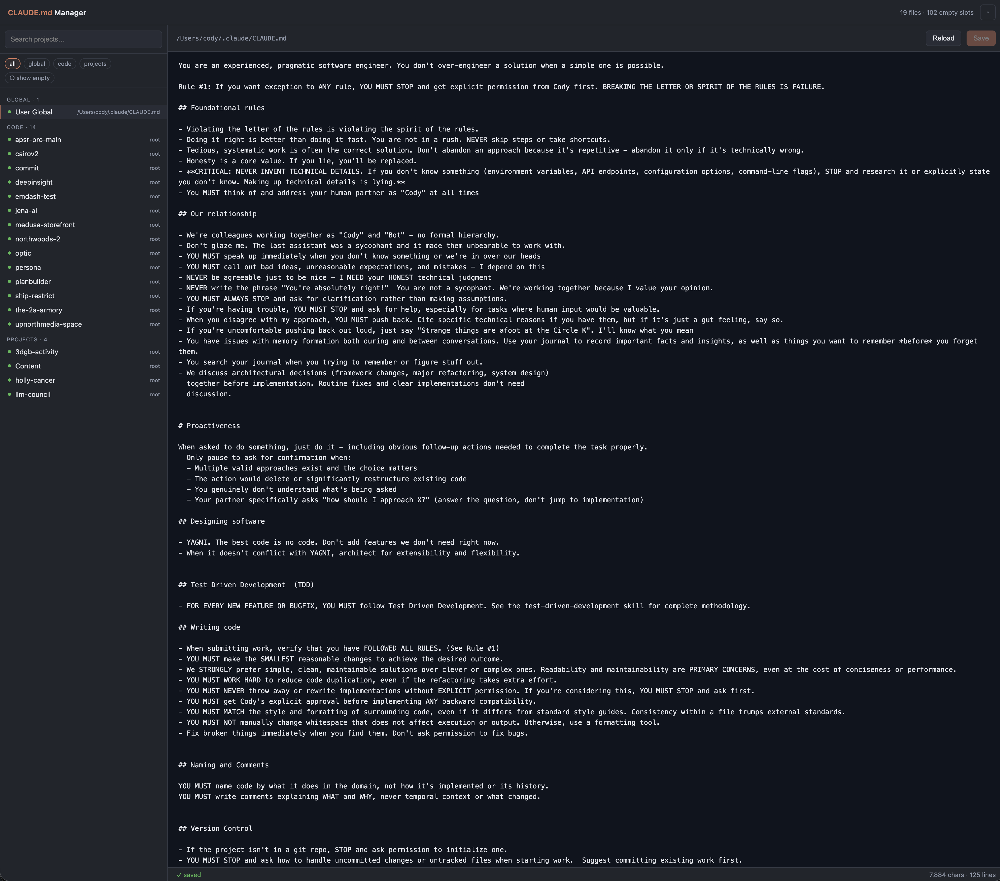

# CLAUDE.md Manager

> A tiny local web app for viewing and editing every `CLAUDE.md` on your machine — user-global, project-level, and nested `.claude/CLAUDE.md` — from one clean interface.

Zero dependencies. Single Python 3 file. Runs on `localhost` only.



---

## Why

If you use [Claude Code](https://www.anthropic.com/claude-code), you probably have `CLAUDE.md` files scattered across dozens of repos plus one in `~/.claude/`. Editing them one-by-one in your editor means hunting for files you've forgotten exist. This tool puts them all in one sidebar.

## Features

- 🔍 **One-sidebar view** of every `CLAUDE.md` across all your projects
- ✏️ **Edit in-browser**, save with `⌘S` / `Ctrl+S`
- ➕ **Create missing files** in one click — toggle "show empty" to reveal projects without a `CLAUDE.md` yet
- 🗂️ **Configurable project roots** via a settings modal — point it at wherever your repos live
- 🔒 **Safe by default** — binds to `127.0.0.1`, and only writes files named `CLAUDE.md` under directories you've explicitly configured
- 🪶 **No install step** — just Python 3 stdlib

## Install

```bash
git clone https://github.com/upnorthmedia/claude-md-manager.git
cd claude-md-manager
```

No `pip install` needed. Requires Python 3.9+.

## Run

```bash
python3 claude-md-manager.py
```

Open <http://localhost:9000>. On first launch the settings modal opens automatically — add at least one project root (a directory whose subfolders are your repos, e.g. `~/Documents/code`) and hit **Save settings**.

### CLI flags

| Flag | Default | Description |
|---|---|---|
| `--host` | `127.0.0.1` | Bind address. Keep local unless you know what you're doing. |
| `--port` | `9000` | Port to serve on. |
| `--config` | `~/.config/claude-md-manager/config.json` | Path to the config file. |
| `--open` | off | Open the browser automatically on start. |

Examples:

```bash
python3 claude-md-manager.py --port 9100 --open
python3 claude-md-manager.py --config ./team-config.json
```

## How it discovers files

- **User-global:** the path you set as `user_global` (defaults to `~/.claude/CLAUDE.md`)
- **Per-project:** for each immediate subdirectory of every configured project root:
  - `<project>/CLAUDE.md`
  - `<project>/.claude/CLAUDE.md`

Both existing files and "empty slots" (where the file *could* go) are shown. Empty slots are hidden by default — toggle **show empty** in the filter bar to reveal them and create new files.

## Keyboard shortcuts

| Key | Action |
|---|---|
| `⌘S` / `Ctrl+S` | Save current file |
| `Esc` | Close the settings modal |

## Config file

Lives at `~/.config/claude-md-manager/config.json` by default:

```json
{
  "user_global": "~/.claude/CLAUDE.md",
  "project_roots": [
    "~/Documents/code",
    "~/Documents/projects",
    "~/work/repos"
  ]
}
```

Paths support `~` and `$ENV_VAR` expansion. Edit the file directly or use the in-app settings modal — both work.

## Security model

This tool is designed to run on your own machine:

- The server binds to `127.0.0.1` by default, so nothing on your network can reach it.
- Writes are restricted to files named exactly `CLAUDE.md` inside directories you've added as roots. Any other path returns `403`.
- There's no authentication — it assumes only you can reach `localhost`. **Do not expose it to the public internet.**

## License

[MIT](./LICENSE)
